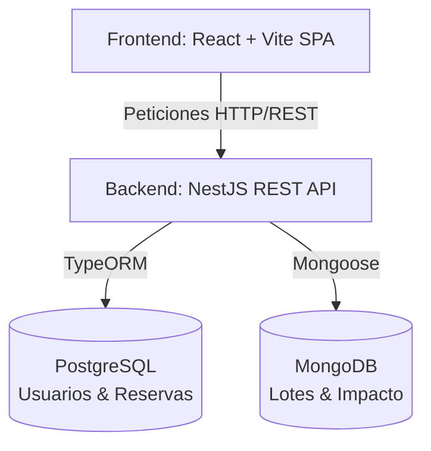
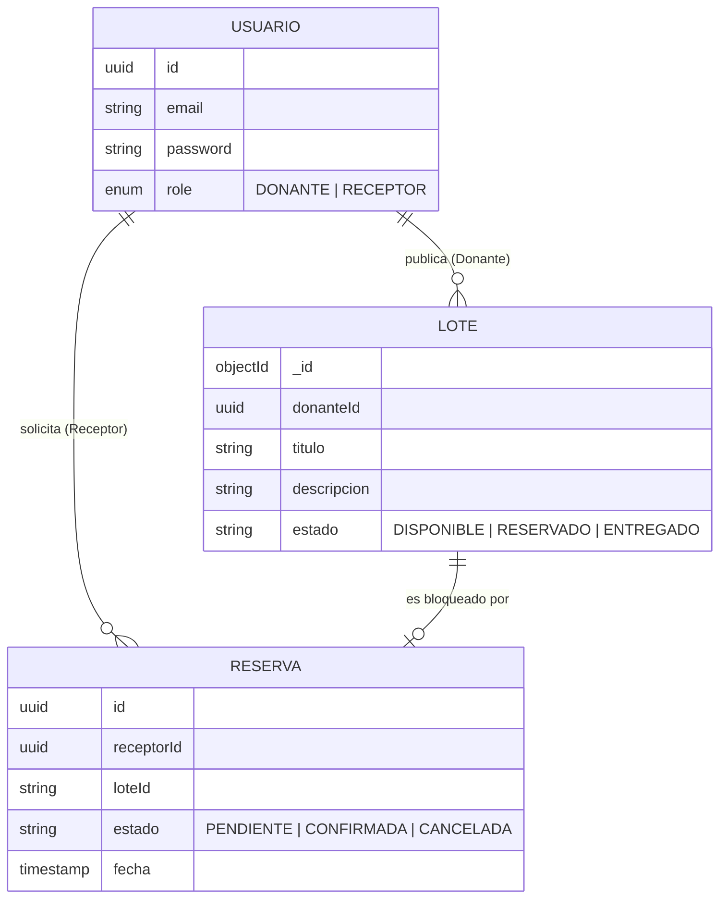
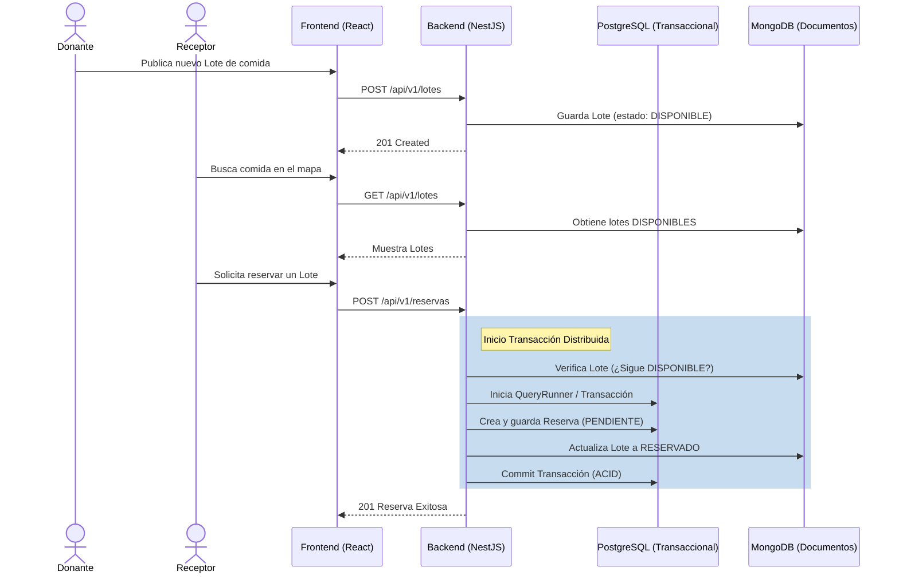

# Documentación Técnica - Proyecto EcoBocado

Esta documentación proporciona una visión exhaustiva y técnica de la arquitectura, dominios, servicios y tecnologías empleadas en el proyecto **EcoBocado**, tanto para el frontend como para el backend.

---

## 1. Arquitectura General del Sistema

El ecosistema de EcoBocado está basado en una arquitectura **Cliente-Servidor** estructurada para ser escalable, segura y mantenible.

- **Frontend**: Single Page Application (SPA) altamente interactiva y responsiva.
- **Backend**: API RESTful robusta y orientada a microservicios simulados a través de módulos altamente desacoplados.
- **Bases de Datos (Híbrida/Políglota)**:
  - **PostgreSQL**: Base de datos relacional para gestionar entidades transaccionales y con relaciones complejas.
  - **MongoDB**: Base de datos NoSQL para almacenamiento de documentos flexibles.

---

## 2. Backend (NestJS)

El backend de EcoBocado está construido sobre **NestJS**, un framework progresivo de Node.js que impone y facilita una arquitectura modular sólida, fuertemente tipada con **TypeScript**.

### 2.1 Tecnologías Principales
- **Framework Core**: NestJS (v11)
- **Lenguaje**: TypeScript
- **ORM / ODM**: TypeORM (para PostgreSQL) y Mongoose (para MongoDB).
- **Autenticación**: Passport.js (Estrategias: JWT y Google OAuth2.0), Bcrypt.
- **Validación y DTOs**: `class-validator` y `class-transformer`.
- **Almacenamiento (Cloud)**: AWS SDK S3 (para manejo de imágenes/archivos).
- **Documentación API**: Swagger UI / OpenAPI (accesible en `/api`).

### 2.2 Patrones de Arquitectura
El backend sigue el patrón de **Arquitectura Modular basada en Dominios**. Cada módulo contiene sus propios Controladores, Servicios y Entidades/Esquemas, fomentando el principio de Responsabilidad Única (SRP) y alta cohesión. Además, se aplican filtros de excepción globales (ej. `MongoExceptionFilter`) y *pipes* de validación global.

### 2.3 Dominios y Servicios

El sistema expone la API bajo el prefijo `api/v1` y se divide en los siguientes módulos principales:

1. **Módulo de Autenticación (`AuthModule`)**
   - **Responsabilidad**: Gestión del ciclo de vida de sesiones, inicio de sesión seguro, emisión y validación de tokens JWT.
   - **Integraciones**: Inicio de sesión mediante OAuth2.0 con Google (`google.strategy.ts`).

2. **Módulo de Usuarios (`UsuariosModule`)**
   - **Responsabilidad**: Administración de los diferentes perfiles del sistema (Donantes, Receptores).
   - **Persistencia**: Manejo de entidades de usuario con contraseñas encriptadas (bcrypt).

3. **Módulo de Lotes (`LotesModule`)**
   - **Responsabilidad**: Gestión del ciclo de vida de los "Lotes" de alimentos (creación, publicación, actualización de estado).
   - **Tecnología**: Probablemente haga uso intenso de almacenamiento en S3 para las imágenes de los productos.

4. **Módulo de Reservas (`ReservasModule`)**
   - **Responsabilidad**: Control de la concurrencia y flujo de asignación de Lotes a Receptores. Manejo de estados de la reserva (Pendiente, Confirmada, Cancelada, Completada).

5. **Módulo de Impacto (`ImpactoModule`)**
   - **Responsabilidad**: Cálculo y persistencia de las métricas ambientales (e.g., CO2 ahorrado, kilogramos de comida rescatada).

6. **Módulo de Estado (`StatusModule`)**
   - **Responsabilidad**: Health checks y monitoreo básico de disponibilidad de la API.

### 2.4 Consumo de Bases de Datos y Connection Pools

El backend de EcoBocado maneja un ecosistema de bases de datos híbrido que impone retos particulares en la gestión de conexiones. Ambas bases de datos se inicializan de manera asíncrona a través del `ConfigModule` en el `app.module.ts`.

#### PostgreSQL (Relacional)
- **Gestión del Pool de Conexiones**: A través de `TypeOrmModule.forRootAsync`, TypeORM emplea el driver nativo `pg`, el cual implementa internamente un mecanismo robusto de *Connection Pooling*. Por defecto, el tamaño máximo del pool (max connections) en aplicaciones Node.js (con TypeORM) suele ser de 10 conexiones concurrentes, lo cual optimiza la memoria y evita la saturación del servidor PostgreSQL. Para escenarios de alta concurrencia, la escalabilidad vertical del pool se maneja inyectando la propiedad `extra: { max: <nuevo_limite> }` en las opciones de configuración.
- **Consumo y Transaccionalidad**:
  - **Patrón Repository**: Los datos se consumen inyectando repositorios nativos de TypeORM mediante el decorador `@InjectRepository(NombreEntidad)`. Esto asegura abstracción total sobre las consultas SQL.
  - **ACID y Concurrencia**: Las operaciones críticas (como el *Módulo de Reservas*) pueden aprovechar transacciones del `QueryRunner` de TypeORM o bloqueos a nivel de fila (*Pessimistic/Optimistic Locking*) para asegurar la consistencia y evitar que un mismo lote sea reclamado por dos receptores a la vez.

#### MongoDB (No Relacional)
- **Gestión del Pool de Conexiones**: Configurado mediante `MongooseModule.forRootAsync`. El driver subyacente de MongoDB de Node.js (vía Mongoose 6+) maneja automáticamente la lógica de reconexión y mantenimiento del pool. Por defecto, su *Connection Pool* tiene un límite mucho más alto (`maxPoolSize: 100`), siendo ideal para consultas masivas concurrentes y operaciones rápidas de escritura (como métricas del *Módulo de Impacto* o logs).
- **Consumo**:
  - Los datos se consumen declarando esquemas de Mongoose y utilizando la inyección de dependencias `@InjectModel(NombreEsquema.name)`.
  - Esta base de datos se orienta a documentos flexibles y autocontenidos, donde se prioriza la velocidad de lectura/escritura y no se requiere de transaccionalidad estricta.

---

## 3. Frontend (React + Vite)

El frontend de EcoBocado es una aplicación React moderna, enfocada en la velocidad, experiencia de usuario fluida (animaciones y transiciones) y un diseño de código escalable.

### 3.1 Tecnologías Principales
- **Core**: React v19, React DOM v19.
- **Bundler y Herramientas**: Vite (extremadamente rápido para HMR y builds optimizados).
- **Estilos e Interfaz**:
  - TailwindCSS v4 (para estilos de utilidad hiper-optimizados).
  - PrimeReact & PrimeIcons (para componentes UI complejos y accesibles).
- **Enrutamiento**: React Router DOM v7.
- **Animaciones**: GSAP (GreenSock) y Framer Motion.
- **Mapas y Geolocalización**: Leaflet y React-Leaflet.
- **Utilidades adicionales**: `html5-qrcode` y `react-qr-code` para manejo de códigos QR.

### 3.2 Arquitectura y Estructura de Directorios (Feature-Driven Design)
La arquitectura del frontend rompe con el clásico patrón MVC monolítico en el cliente, adoptando un enfoque de **Feature Slices**. Todo el código relacionado con una característica particular convive en el mismo lugar, mejorando la mantenibilidad a gran escala.

Estructura de la carpeta `src`:

- **`/features`**: Agrupa la UI y lógica específica por dominios de la aplicación.
  - `auth/`: Vistas y componentes relacionados con login y registro.
  - `donor/`: Interfaces para el perfil del donante (publicación de lotes, settings, dashboard).
  - `receptor/`: Interfaces para el perfil del receptor (búsqueda de lotes, mapa de ubicación, reservas).
  - `landing/`: Componentes para la página de inicio o presentación pública.
  - `common/`: Vistas o layouts transversales.

- **`/services`**: Capa de abstracción de red (API Gateway interno). Aquí se encuentran las funciones que consumen el backend de NestJS:
  - `api.js`: Configuración base de Axios o Fetch.
  - `authService.js`, `impactoService.js`, `loteService.js`, `reservaService.js`, `storageService.js`.

- **`/components`**: Componentes visuales genéricos, tontos (dumb components) y reutilizables en cualquier feature (ej. Botones, Tarjetas genéricas, Modales).

- **`/contexts`**: Gestión del estado global mediante la React Context API (ej. `AuthContext`, `ThemeContext`).

- **`/config`**: Variables de configuración globales del frontend.

### 3.3 Patrones Clave en el Frontend
- **Desacoplamiento de Servicios**: La UI no hace fetch directamente, delega esta tarea a la capa de `services`, permitiendo simular (mocking) y manejar errores centralizadamente.
- **Rutas Protegidas**: Uso de React Router para proteger el acceso a las features de `donor` y `receptor` verificando el estado del token JWT o la sesión de Google.
- **Micro-animaciones**: Uso intensivo de `framer-motion` y `gsap` para dar retroalimentación visual al usuario, lo que aumenta la percepción de calidad (premium UI).

---

## 4. Resumen del Flujo de Datos

1. **Autenticación**: El usuario se autentica en el Frontend (vía formulario o Google Auth). El Frontend (`authService`) llama al Backend (`AuthModule`). El Backend devuelve un JWT.
2. **Publicación de Lote**: El *Donante* usa su *Feature* en el frontend para subir un lote (foto, descripción, ubicación). El Frontend sube la imagen a S3 vía el backend (`LotesModule`) y guarda los metadatos en Postgres/MongoDB.
3. **Reserva**: El *Receptor* visualiza los lotes en el mapa interactivo (Leaflet), y emite una solicitud. El Frontend llama al `reservaService`, el cual contacta al `ReservasModule` del backend, generando un registro transaccional para evitar condiciones de carrera.
4. **Impacto**: Una vez completada la donación (posiblemente confirmada vía un escaneo QR), el backend actualiza el `ImpactoModule`, y el frontend refleja los logros en el dashboard (animados con GSAP/Chart.js).

---

## 5. Diagramas de Arquitectura y Procesos

### 5.1 Arquitectura General (C4 Context)
Este diagrama ilustra la separación de responsabilidades entre el cliente (SPA), el Gateway (NestJS) y la arquitectura híbrida de base de datos.

### 5.2 Modelo Conceptual de Base de Datos (Relaciones)
Aunque el sistema usa una base de datos políglota, conceptualmente las entidades se relacionan de la siguiente manera. **PostgreSQL** maneja la integridad y las transacciones críticas de usuarios y reservas, mientras **MongoDB** permite agilidad para los lotes y el cálculo de impacto.

### 5.3 Pipeline de Flujo Principal: Donación y Reserva
El siguiente diagrama de secuencia detalla cómo los distintos actores interactúan con el Frontend, y cómo el Backend orquesta la transacción distribuida entre Mongo y Postgres para asegurar que no haya problemas de concurrencia.

---
*Documentación generada y enriquecida automáticamente basada en la inspección de los repositorios frontend y backend de EcoBocado.*
